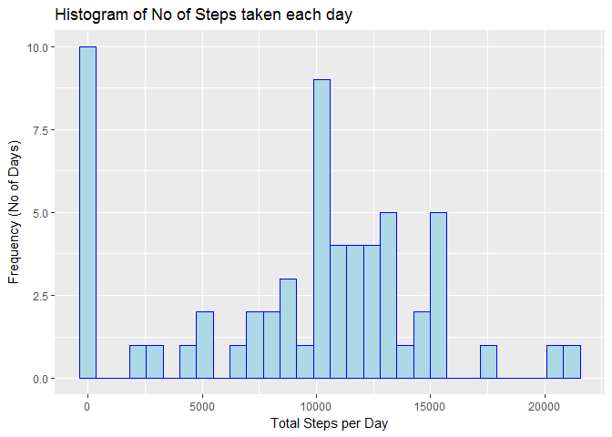
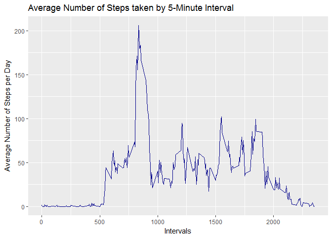
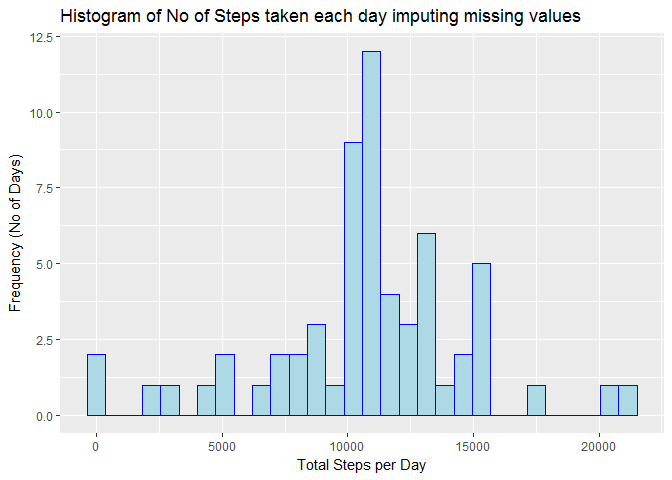
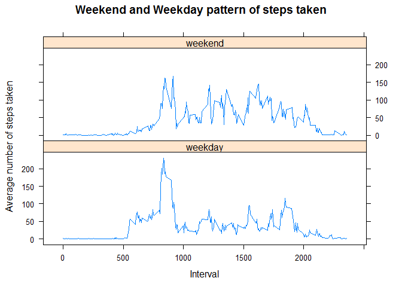

# Reproducible Research: Peer Assessment 1


## Loading and preprocessing the data

I am going to use dplyr, ggplot2 and lattice in this exercise. So, loading the libraries first. Also, warning and message are set to FALSE to tidier output.
The numbered headings in different sections indicate the instruction numbers as provided in assignment instructions.


```r
# Load all libaries
library(ggplot2)
library(dplyr)
library(lattice)
```


The next portion deals with downloading the data from server and unzipping it.


```r
# Download Data
fileUrl<-"https://d396qusza40orc.cloudfront.net/repdata%2Fdata%2Factivity.zip"
download.file(fileUrl,destfile = "./activity.zip")
unzip("./activity.zip")
```

#### 1. Load the data

Next, we load the data in a dataframe with read.csv.


```r
activity<-read.csv(file = "activity.csv")
```

#### 2. Preprocess Dates from Factor to Dates

*date* is in the format of Factor. So, next we transform it to proper_date with appropriately titled label *proper_date*.


```r
activity$proper_date<-as.Date(activity$date,"%Y-%m-%d")
```


## What is mean total number of steps taken per day?

In this part, missing values are ignored with na.rm=TRUE.

#### 1. Total steps taken each day

We calculate the total steps taken each day and take a glimpse of the first few rows.


```r
steps_per_day<-activity%>%
    group_by(proper_date)%>%
    summarise(total_steps=sum(steps,na.rm=T))

head(steps_per_day)
```

```
## # A tibble: 6 x 2
##   proper_date total_steps
##        <date>       <int>
## 1  2012-10-01           0
## 2  2012-10-02         126
## 3  2012-10-03       11352
## 4  2012-10-04       12116
## 5  2012-10-05       13294
## 6  2012-10-06       15420
```

#### 2. Histogram

Now, we plot a histogram charting Steps per day and the frequency (in days) with ggplot2.


```r
ggplot(steps_per_day,aes(x=total_steps))+
    geom_histogram(color='blue',fill='lightblue')+
    labs(x="Total Steps per Day", 
         y="Frequency (No of Days)",
         title="Histogram of No of Steps taken each day"
         )
```

<!-- -->

#### 3. Mean and Median steps taken per day

Next, we calculate the mean.


```r
# Mean
mean_steps<-round(mean(steps_per_day$total_steps),0)
mean_steps
```

```
## [1] 9354
```

And median.


```r
# Median
median_steps<-round(median(steps_per_day$total_steps),0)
median_steps
```

```
## [1] 10395
```


## What is the average daily activity pattern?


#### 1. Time series plot of Average number of steps taken by intervals

Next, we first calculate average steps taken across each interval segment. Note that, missing values are ignored here.

Then, we create a time series plot using ggplot2.


```r
steps_by_interval<-activity%>%
    group_by(interval)%>%
    summarise(average_steps=mean(steps,na.rm=T))


ggplot(steps_by_interval,aes(x=interval,y=average_steps))+
    geom_line(color='darkblue')+
    labs(x="Intervals",
         y="Average Number of Steps per Day",
         title="Average Number of Steps taken by 5-Minute Interval"
         )
```

<!-- -->

#### 2. Interval with Maximum steps on average

Then, we find the interval when maximum steps happened. 
We found the winner is 835th interval with average steps of ~206.


```r
interval_with_max_steps<-steps_by_interval%>%
    top_n(1,average_steps)%>%
    select(interval)

interval_with_max_steps$interval[1]
```

```
## [1] 835
```


## Imputing missing values

After that we impute the missing values.

#### 1. Total Number of Rows with missing values

From the below code, we get 2304 rows are having missing values and all of them are in *steps* column.


```r
colSums(is.na(activity))
```

```
##       steps        date    interval proper_date 
##        2304           0           0           0
```

#### 2. Strategy for imputing missing values

To fill up the missing values, I decided to put mean of that specific intervals in case data is missing. Also, I decided to go with rounding to next larger integer to have a practical value for steps.

#### 3. Fill Up missing values

Next, we executed the strategy with R code with the help of dplyr package.
We took only the column that are needed and stored it in a new dataframe titled *activity_new*.


```r
activity_new<-activity%>%
    left_join(steps_by_interval,by="interval")%>%
    mutate(
        step_wo_na=ifelse(is.na(steps),ceiling(average_steps),steps)
    )%>%
    select(proper_date,interval,step_wo_na)
```

#### 4. Histogram, Mean and Median based after imputing

Next, we calculate total steps per day considering the imputed values.


```r
# Total steps taken each day
steps_per_day_new<-activity_new%>%
    group_by(proper_date)%>%
    summarise(total_steps=sum(step_wo_na))
```

Again, we plot a histogram - this time with the imputed values.


```r
# Histogram

ggplot(steps_per_day_new,aes(x=total_steps))+
    geom_histogram(color='blue',fill='lightblue')+
    labs(x="Total Steps per Day", 
         y="Frequency (No of Days)",
         title="Histogram of No of Steps taken each day imputing missing values"
         )
```

<!-- -->


Again, we calcualte mean.


```r
# Mean steps taken per day

mean_steps_new<-round(mean(steps_per_day_new$total_steps),0)
mean_steps_new
```

```
## [1] 10785
```

And median.


```r
# Median of steps taken per day
median_steps_new<-round(median(steps_per_day_new$total_steps),0)
median_steps_new
```

```
## [1] 10909
```

The values differ greatly from the first part of the assignment with mean and median deviating by 1431 amd 514 steps respectively. Without imputing, NA values where contributing zero while summing the steps resulting in skewed result (especially in case of mean) towards zero. But with imputed values, both mean and median are around the middle (i.e. 10500 area) of the histogram distribution where frequency is most.


```r
# Difference with and without imputing missing values

# Mean
mean_steps_new-mean_steps
```

```
## [1] 1431
```

```r
# Median
median_steps_new-median_steps
```

```
## [1] 514
```


## Are there differences in activity patterns between weekdays and weekends?

Finally, we observe difference in activity pattern between weekdays and weekends.

#### 1. New Factor variable to indicate Weekend and Weekday

First, we stored names of weekends in a variable called *weekend*.
Then we create a column titled *Day_ID* in the dataframe which indicates *weekend* if the days are weekend and *weekday* otherwise.

Finally, we store relevant info in a new dataframe title *activity_new_2*.


```r
weekend<-c('Sat','Sun')

activity_new_2<-activity_new%>%
    mutate(
        Weekday=weekdays(proper_date,abbreviate=T),
        Day_ID= as.factor(ifelse(Weekday %in% weekend,'weekend','weekday'))
    )%>%
    select(proper_date,interval,step_wo_na,Day_ID)
```

#### 2. Panel plot comparing Weekdays and Weekends

Finally, we create a panel plot using lattice package (same can be done with ggplot2 and facet_grid) charting average steps segregated by weekday and weekend.


```r
steps_by_interval_new<-activity_new_2%>%
    group_by(Day_ID,interval)%>%
    summarise(average_steps=mean(step_wo_na))


xyplot(average_steps~interval|Day_ID,data=steps_by_interval_new,
       type='l',
       layout=c(1,2),
       xlab="Interval",
       ylab = "Average number of steps taken",
       main="Weekend and Weekday pattern of steps taken"
       )
```

<!-- -->

During Weekdays the user is active from early hours whereas in weekends activity starts late which is not surprising considering long sleeps on weekends.
On the other hand, user seems to be more active during day on weekends compared to weekdays probably due to low movement during working hours.
